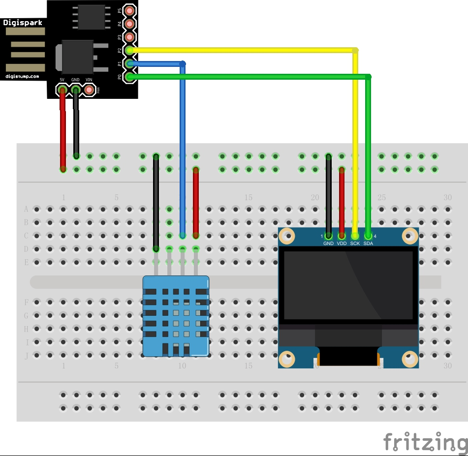

# Tiny DHT11

A tiny project that displays current humidity and temperature on SSD1306 I2C OLED , and fit into Attiny85 with 8KB Flash and 512 Bytes SRAM. 

## Circuits

## Related Projects

- TinyWireM: [https://github.com/adafruit/TinyWireM](https://github.com/adafruit/TinyWireM)
- SSD1306_minimal: [https://github.com/kirknorthrop/SSD1306_minimal](https://github.com/kirknorthrop/SSD1306_minimal)

## Contact

Author：Wu Han  
Homepage：http://wuhanstudio.cc  
Contact：https://github.com/wuhanstudio/tiny-dht11/issues
